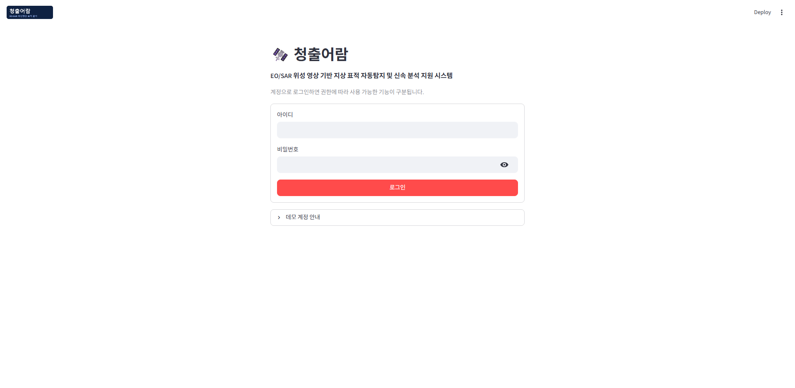
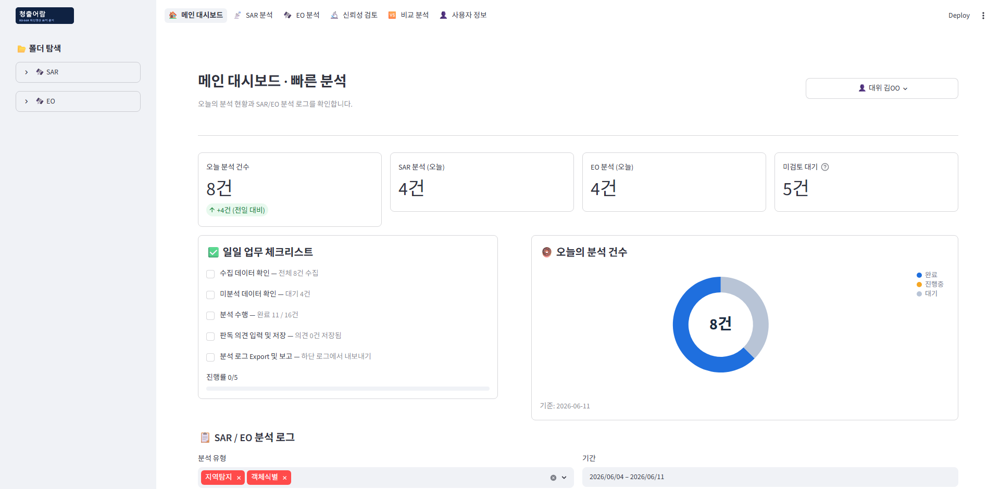
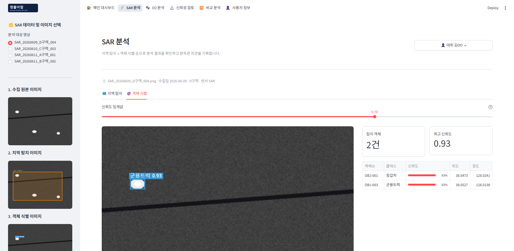
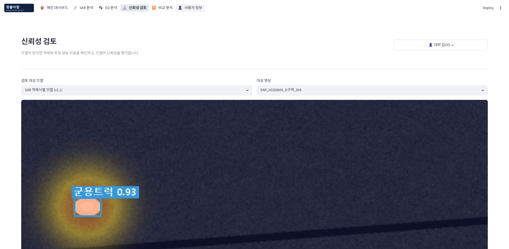
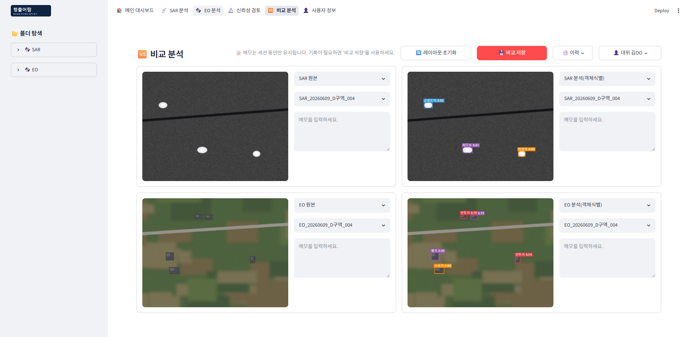
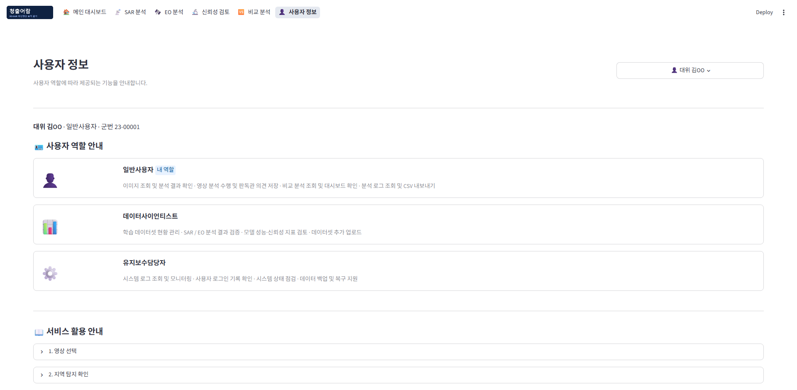

# 🛰️ 청출어람 — EO/SAR 위성영상 기반 표적 후보 탐지 및 판독 지원 서비스

EO(광학)·SAR(레이더) 위성영상에 대한 AI 객체 탐지 결과를 **영상판독관**에게 제공하여 1차 탐색 부담을 줄이고,
Grad-CAM 기반 AI 집중 영역 검토와 시간대별 변화 분석·표적 후보 유형 분류를 통해
**영상판독관과 지휘관의 최종 의사결정을 보조**하는 분석 대시보드입니다.

> AI 결과는 표적 확정값이 아니라 **표적 후보**로만 제공하며, 자동 타격 권고·화력유도 자동화·현재 위치 확정 기능은 제공하지 않습니다.
> 공식 사용자는 **영상판독관·지휘관** 2역할이며, 모델 성능·SHAP 분석·시스템 유지보수는 내부 검증/향후 고도화 기능으로 분리됩니다.

- 팀명: **청출어람** (스마트 국방 데이터 분석과정 7회차 최종 프로젝트)
- UI 원칙: **Streamlit 기본 위젯만 사용** — 외부 UI 라이브러리·커스텀 HTML/CSS 미사용 (차트는 Streamlit 내장 의존성인 Altair 활용)

---

## 주요 기능

**영상판독관** 메뉴:

| 페이지 | 핵심 기능 |
|---|---|
| 🔐 로그인 | 아이디/비밀번호 인증, 역할(영상판독관·지휘관)별 메뉴 구분, 로그인 기록 저장 |
| 🏠 메인 대시보드 | 6종 KPI(오늘 분석·탐지 객체 수·재확인 필요·신규 등장·소실·판독 완료), 도넛 차트(완료/진행중/대기), 일일 업무 체크리스트, 최근 분석 미리보기 |
| 📡 SAR 분석 / 🛰️ EO 분석 | 사이드바 단계별(수집 원본→지역탐지→객체식별) 썸네일 선택, 관심 구역(AOI)·후보 표적 테이블, **신뢰도 임계값 슬라이더** 실시간 필터링, **표적 후보 유형(단일/지역/광역) 분류**, 판독관 의견 저장·Export |
| 🔬 신뢰성 검토 | Grad-CAM 집중 영역 결합 뷰, **판독 권고(신뢰/재확인/수동 판독)**·Grad-CAM 해석 가이드, 모델 성능·SHAP는 '내부 검증 자료' expander로 분리 |
| 🆚 비교 분석 | SAR/EO 원본·분석 영상 4사분면 자유 배치, 사분면별 메모(500자), 레이아웃 초기화, 비교 결과 저장·이력 조회 |
| ⏱️ 시간대별 변화 분석 | 동일 구역 이전/현재 시점 4분할 비교, bbox 중심좌표 매칭으로 **신규/소실/유지/위치·클래스 변화/불확실** 분류, 변화 KPI·메모 저장 |
| 🧾 분석 로그·인수인계 | AI 결과/판독관 의견/지휘관 조치 **분리 조회**, 필터·검색·CSV Export, 인수인계 요약·완료 표시 |
| 👤 사용자 정보 | 역할 안내 카드(영상판독관·지휘관), 역할별 서비스 활용 가이드 |

**지휘관** 메뉴:

| 페이지 | 핵심 기능 |
|---|---|
| ⭐ 지휘관 요약 | 재확인 필요 표적 후보 현황·표적 유형·변화 요약, **후속 조치 기록(지속 감시·추가 정찰 요청·대응 준비·상급 보고)**, 분석 로그 기반 **요약 보고서(인쇄 서식 HTML) 출력** |
| 🧾 분석 로그·인수인계 | 분석 로그·판독관 의견·지휘관 조치 조회 |
| 👤 사용자 정보 | 역할 안내·활용 가이드 |

## 화면 미리보기

| 로그인 | 메인 대시보드 |
|---|---|
|  |  |

| SAR 분석 (객체 식별) | 신뢰성 검토 |
|---|---|
|  |  |

| 비교 분석 | 사용자 정보 |
|---|---|
|  |  |

> EO 분석 페이지는 SAR 분석과 동일한 템플릿(`views/analysis.py`)을 공유하므로 미리보기를 생략했습니다.

## 기술 스택

- **Python 3.10+** (개발 환경: 3.14)
- **Streamlit ≥ 1.46** — `st.navigation(position="top")` 상단 탭, `st.logo`, `st.metric`, `st.dataframe`(ProgressColumn), `st.popover`, `st.tabs`, `st.columns` 등 기본 위젯
- **Altair** (Streamlit 내장 의존성) — 도넛 차트, SHAP 히스토그램
- **Pillow** — 더미 영상 생성, 탐지 박스 실시간 렌더링
- **pandas** — CSV 기반 데이터 관리

## 설치 및 실행

```bash
pip install -r requirements.txt
python -m streamlit run app.py
```

- 첫 실행 시 `data/` 폴더가 없으면 **더미 데이터(영상·CSV·로고)가 자동 생성**됩니다.
- 더미 데이터를 다시 만들려면: `python generate_dummy_data.py`

## 데모 계정

| 아이디 | 비밀번호 | 역할 | 진입 메뉴 |
|---|---|---|---|
| `user` | 1234 | 영상판독관 | 메인 대시보드·SAR/EO 분석·신뢰성·비교·변화 분석·인수인계 |
| `cmd` | 1234 | 지휘관 | 지휘관 요약·인수인계 |

## 페이지별 사용 흐름

### 영상판독관
1. **로그인** 후 상단 탭으로 페이지를 이동합니다. 우측 상단에서 회원 정보 확인·로그아웃이 가능합니다.
2. **메인 대시보드**에서 6종 KPI(재확인 필요·신규·소실 등)와 최근 분석 현황을 확인합니다.
3. **SAR/EO 분석**: 영상 선택 → `지역 탐지`에서 AOI·후보 표적 확인 → `객체 식별`에서 신뢰도 임계값 조절·표적 후보 유형(단일/지역/광역) 확인 → 판독관 의견 저장.
4. **신뢰성 검토**에서 Grad-CAM 집중 영역과 판독 권고(신뢰/재확인/수동 판독)를 확인합니다. (모델 성능·SHAP는 '내부 검증 자료' expander)
5. **시간대별 변화 분석**에서 동일 구역 이전/현재 시점을 4분할로 비교해 신규·소실·위치 변화를 확인하고 메모를 저장합니다.
6. **분석 로그·인수인계**에서 AI 결과·판독관 의견·지휘관 조치를 분리 조회하고 CSV로 Export, 인수인계를 완료 처리합니다.

### 지휘관
1. **지휘관 요약**에서 재확인 필요 표적 후보·표적 유형·변화 요약을 확인합니다.
2. 지속 감시·추가 정찰 요청·대응 준비·상급 보고 등 **후속 조치를 기록**합니다.
3. 분석 로그 기반 **요약 보고서를 인쇄 서식(HTML)으로 출력**합니다. (브라우저 인쇄 → PDF 저장)

## 프로젝트 구조

```
Project/
├── app.py                  # 진입점 — 로그인 게이팅 + st.navigation 상단 탭
├── common.py               # 계정·세션, 공통 헤더/사이드바, 데이터 로더, 탐지 박스 렌더링
├── generate_dummy_data.py  # 더미 데이터 생성 (영상·CSV·Grad-CAM·로고)
├── requirements.txt
├── views/
│   ├── login.py            # 로그인
│   ├── home.py             # 메인 대시보드 (6종 KPI·체크리스트·도넛)
│   ├── analysis.py         # SAR/EO 분석 (공용 템플릿·표적유형 분류)
│   ├── reliability.py      # 신뢰성 검토 (Grad-CAM 판독 권고·내부 검증)
│   ├── compare.py          # 비교 분석 (4사분면)
│   ├── change_analysis.py  # 시간대별 변화 분석 (신규/소실/변화 매칭)
│   ├── handover.py         # 분석 로그·인수인계 (AI/판독관/지휘관 분리)
│   ├── commander.py        # 지휘관 요약·조치 기록·보고서
│   └── user_info.py        # 사용자 정보 (판독관·지휘관 안내)
├── data/                   # 자동 생성 — 영상·CSV (아래 '데이터 개요' 참고)
├── docs/images/            # README 스크린샷
├── capture_screens.py      # 스크린샷 일괄 캡처 (Playwright)
├── verify_app.py           # 전 페이지 렌더링 검증 (AppTest)
├── verify_flow.py          # 로그인 흐름 검증
└── verify_fit.py           # 비교 분석 1080p 화면 맞춤 측정
```

## 데이터 개요

DB 대신 **로컬 이미지 폴더 + CSV** 조합으로 동작하며, 화면에는 파일 경로만 연결됩니다.

```
data/
├── images/{SAR,EO}/{원본,지역탐지,객체식별}/   # 처리 단계별 영상 — 영상명: {센서}_{날짜}_{구역}_{HHMM}
│                                              #   구역마다 2시점(10:00/10:30) 페어 생성 → 시간대별 변화 분석
├── xai/{SAR,EO}/                              # Grad-CAM 히트맵 (*_boxes.png = 탐지 박스 결합본)
├── assets/logo.png
├── detections.csv         # 객체 탐지 결과 (클래스·신뢰도·픽셀/위경도 좌표)
├── regions.csv            # 지역탐지 관심 구역(AOI) 정보
├── analysis_log.csv       # 분석 로그 (AI 결과·상태·판독관·내용)
├── login_history.csv      # 로그인 기록
├── opinions.csv           # 판독관 의견/판단 (의견 저장 시 생성·누적)
├── comparisons.csv        # 비교 분석 저장 이력 (비교 저장 시 생성·누적)
├── change_memos.csv       # 시간대별 변화 분석 메모 (저장 시 생성·누적)
└── commander_actions.csv  # 지휘관 조치 기록 (조치 저장 시 생성·누적)
```

## 검증

```bash
python verify_app.py    # 전 페이지 × 역할 3종 렌더링 예외 검사
python verify_flow.py   # 로그인 게이팅 → 메인 대시보드 진입 흐름
python verify_fit.py    # 비교 분석 페이지 1080p 스크롤 여부 측정 (서버 8504 포트 실행 필요)
python capture_screens.py  # README 스크린샷 재캡처 (서버 8504 포트 실행 필요)
```

## 실제 모델 연동

현재 탐지 결과는 더미 데이터입니다. 실제 탐지 모델 연동 시 `detections.csv` / `regions.csv`를 생성하는
`generate_dummy_data.py` 부분만 모델 출력으로 교체하면 화면 로직은 그대로 동작합니다.
